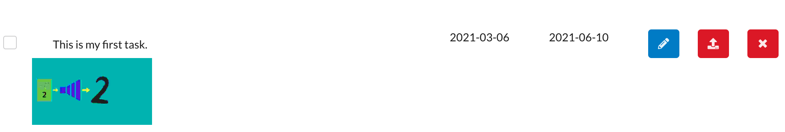
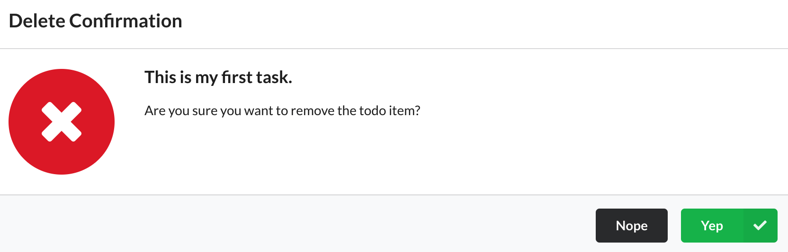

# Simple Task List Manager

This project is a serverless application based on AWS CDK.

## Frontend

A user of this web application can use the interface to create, delete and complete task items.

### Start the frontend applicaiton

First, start the frontend application from the `frontend` folder.

```bash
npm install # if not already done so

npm start
```

### Login

Then, login with **Auth0** to provide your identity.


Create a user with an email and a password or login with Google account.


A user can create a new task by clikcing the **Add Task** button.

### Logout

A list of tasks is maintained for each credential so if you login with a different credential, you will have another task list.

You can logout by using the **Login** menu item.

### New Task Creation

Click the **Add Task** button to create a new task.


Simply fill in the task details, and press the **Add** button.


The new task will be stored in AWS DynamoDB table and reflected in the web application.


You can add as many tasks as you need.

## Complete a task

You can mark the task completion by clicking the checkbox on the left. 

### Edit a Task

Click the pencil button for the task item to edit it.


Update the task details and press the **Update** button.


### Upload an image

Upload an image for a task by pressing the upload button (the middle red button next to the pencil button).


Choose an image file and press the **Upload** button.

The image will be uploaded to the user specific AWS S3 bucket securely using a pre-signed url.



### Delete a task

You can delete a task by clicking the **X** button and confirm the deletion.



### Implementation

For the frontend, I used React + Redux (with Thunk) to keep track of the application states.

## Backend

The backend uses the following AWS resources:

- An API Gateway
- Lambda functions
- S3 buckets
- A DynamoDB table

### API Gateway

The API Gateway uses a Lambda authorizor to authorize users to access AWS resources via Lambda functions.

Before a request reaches to a Lambda function, there is a request validator checking the request body so it will not waste Lambda compute time if the request is not properly formed.

### Lambda functions

Each Lambda function is implemented in a separate file under the `backend/src/lambda` folder.

Lambda functions delegates the business logic to the code implemented in `backend/src/businessLogic.ts`.

The business logic uses other codes (in seperate files) to perform database CRUD operations and S3 handling.

All those codes make use of `async/await` or `Promise` features for better performance and readability.

### Persistence

A DynamoDB table is used to persist task items.


The `userId` is the partition key and the `taskId` is the sort key (items are fetched using the query method).

### CDK instead of Serverless Framework

I decided to use AWS CDK (Cloud Development Kit) instead of the Serverless Framework so that I can take advantage of local deployment feature and easier debugging.

On top of this, I understand better how the AWS resource allocation and permission grant works.

The best part of CDK is that it compiles and I can easily find bugs.

Also, associating IAM roles and permissions to each function is pretty straight forward.

### Distributed Tracing

AWS X-Ray is enabled so that it is easy to find out where an error has occurred.


### Logging

AWS CloudWatch Log is another way to troubleshoot the backend logic.


